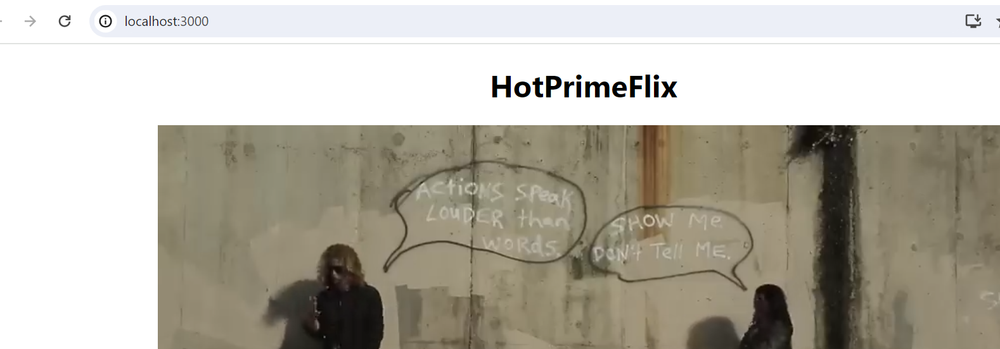
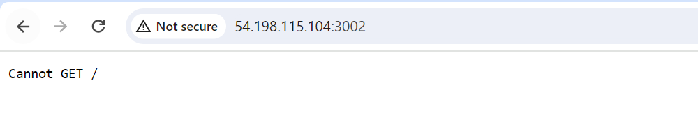
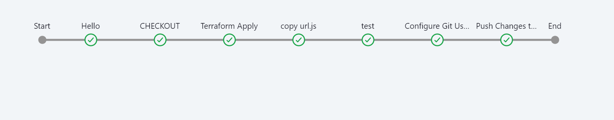
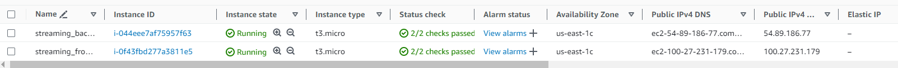
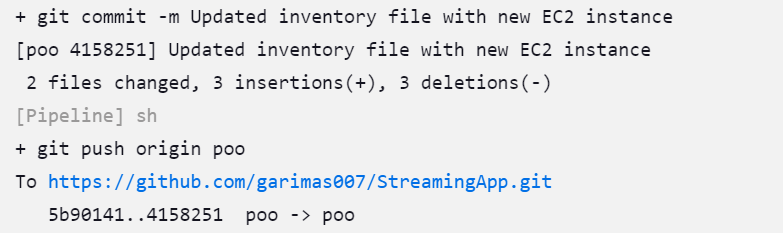

# StreamingApp
Collaborative Streaming application

## Backend

### AuthService
`.env` file for the Authentication Service.

```sh
PORT=3001
MONGO_URI="yourMongoDB_URIwithDatabaseName"
JWT_SECRET="writesomerandomsecrets"
AWS_KEY_ID='asfdasdfasfasf'
AWS_SECRET_KEY='adsafsasfdafs'
AWS_REGION='ap-south-1'
AWS_S3_BUCKET='streamingappservice'
```
-------------------------------------------------------------------------
# This is poovarasan branch

# local setup

* create a .env in each services that contains all the details mentioned above.
* To run backend services use commands mentioned below
```
cd \backend\streamingService
npm install
node index.js
```
* for frontend
```
cd frontend
npm i
npm start
```
* you can get the sample output has mentioned below



# Dockerfile

* create a docker file in both frontend and backend folder which helps to deploy application.
* Docker file are updated in specifies folder.

# Jenkins
Deployment done by docker, run docker image on ec2 instance and test

* Create a jenkins pipeline to build and deploy the application in EC2 instance.
* make sure updated all the necesssary components for .env file in jenkin secreat file.
* Steps followed in jenkins file.
1. Checkout the code base from github.
```
stage('CHECKOUT') {
            steps {
                echo 'clone the git code' 
                git branch: 'poo', url:'https://github.com/garimas007/StreamingApp.git'
            }
        }
``` 
2. Created .env file.
3. Builld a docker file and pushed into docker repo.
```
stage('build backend') {
                    steps {
                        script {
                            docker.build("${env.DOCKER_IMAGE_BACKEND_stream}:${env.BUILD_ID}", './backend/streamingService/')
                            echo ("done")
                        }
                    }
                }
```
```
 docker.withRegistry('https://index.docker.io/v1/', 'docker-hub-credentials') {
                        docker.image("${env.DOCKER_IMAGE_BACKEND_stream}:${env.BUILD_ID}").push()
 }
```
4. Deploy the docker image in EC2 instance, you can get the output as mentioned below.

Frontend


Backend


-------------------------------
# Jenkins Terraform pipeline 

* created a jenkins pipeline that created EC2 instance using terraform, updated the EC2 instance ip address in inventory file and pushed the changes to git.
* Jenkins code is updated in jenkinsfile1
* Steps that are followed.


1. Clone the code from git.
2. Initiate the terraform command to run main.tf file to create 2 EC2 instance.

3. Terraform provisioners updated the inventory file and url.js file and then copy the url.js file to frontend folder.
4. configure git credencials.
5. push the code back to github, that can be used to dockerize further.


---------------
# obstacles faced

To established connection between backend and frontend instances, backend ip address need to updated in frontend App.js file, so modified the code that frontend will takes the connection string from url.js file.

------------
# Jenkins Ansible pipeline

* Instance ip updated in inventory and url.js file by first jenkins pipeline.
* Then procede with the deployments using ansible.

* steps follows in pipeline
1. Clone code from github.
2. Build image with latest changes.
3. Pushed the image into docker hub.
4. Deploy the application in instance using ansible-playbook.


