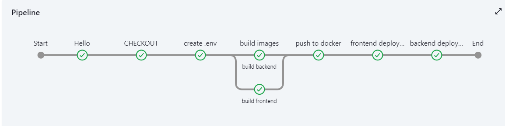

# StreamingApp
Collaborative Streaming application

## Backend

### AuthService
`.env` file for the Authentication Service.

```sh
PORT=3001
MONGO_URI="yourMongoDB_URIwithDatabaseName"
JWT_SECRET="writesomerandomsecrets"
AWS_KEY_ID='asfdasdfasfasf'
AWS_SECRET_KEY='adsafsasfdafs'
AWS_REGION='ap-south-1'
AWS_S3_BUCKET='streamingappservice'
```
-------------------------------------------------------------------------
# Project: DevOps Pipeline for MERN Stack Streaming Application

**Problem Statement:**

The objective is to develop a robust DevOps pipeline for a streaming application built on the MERN stack (MongoDB, Express.js, React, Node.js), where videos are uploaded to an AWS S3 bucket. This project encompasses the creation of a multi-stage Docker image for the application, ensuring scalability, security, monitoring, and efficient deployment strategies including blue-green deployments. The infrastructure automation will be managed using Terraform, while the database will be configured to run on-premise (locally on the learner's laptop). The project will also implement GitOps practices for continuous deployment, maintaining separate environments for staging, development, and production.

**Goals and Deliverables:**

1. Infrastructure as Code (IaC):
   - Use Terraform to provision and manage AWS cloud resources, including S3 buckets for video storage, EC2 instances for hosting the application, and necessary networking components.
   - Document the Terraform scripts and configurations for easy replication and deployment.

2. Dockerization and CI/CD Pipeline:
   - Develop a multi-stage Dockerfile for building lightweight, efficient images of the MERN stack application.
   - Set up Jenkins or GitHub Actions for continuous integration and delivery, automating the build, test, and deployment process across development, staging, and production environments.
   - Implement GitOps practices, using tools like ArgoCD or Flux for continuous deployment based on git repository changes.

3. Database Configuration:
   - Configure MongoDB to run locally on the learner's laptop, ensuring secure access and integration with the cloud-hosted application components.
   - Provide detailed setup and configuration instructions, including data backup and recovery procedures.

4. Security and Monitoring:
   - Implement security best practices, including the use of AWS IAM for access control, encryption of data in transit and at rest, and regular security audits.
   - Use Prometheus and Grafana for monitoring the application's performance and infrastructure health.
   - Configure alerts for any performance issues or security threats.

5. Deployment Strategy:
   - Implement a blue-green deployment strategy to minimize downtime and risk by maintaining two production environments.
   - Automate the switch-over process between blue and green environments, ensuring seamless deployment of new application versions.

6. Scalability and Backups:
   - Ensure the application is scalable, utilizing AWS Auto Scaling Groups to handle varying loads.
   - Automate the backup process for the S3 bucket and on-premise MongoDB database, including periodic backups and secure storage of backup data.
---------------------------------------------------------------------------------------
# **SOLUTION**

# local setup

* create a .env in each services that contains all the details mentioned above.
* To run backend services use commands mentioned below
```
cd \backend\streamingService
npm install
node index.js
```
* for frontend
```
cd frontend
npm i
npm start
```
* you can get the sample output has mentioned below


# Dockerfile

* create a docker file in both frontend and backend folder which helps to deploy application.
* Docker file are updated in specifies folder.

# Jenkins
Deployment done by docker, run docker image on ec2 instance and test

* Create a jenkins pipeline to build and deploy the application in EC2 instance.
* make sure updated all the necesssary components for .env file in jenkin secreat file.
* Steps followed in jenkins file.
1. Checkout the code base from github.
```
stage('CHECKOUT') {
            steps {
                echo 'clone the git code' 
                git branch: 'poo', url:'https://github.com/garimas007/StreamingApp.git'
            }
        }
``` 
2. Created .env file.
3. Builld a docker file and pushed into docker repo.
```
stage('build backend') {
                    steps {
                        script {
                            docker.build("${env.DOCKER_IMAGE_BACKEND_stream}:${env.BUILD_ID}", './backend/streamingService/')
                            echo ("done")
                        }
                    }
                }
```
```
 docker.withRegistry('https://index.docker.io/v1/', 'docker-hub-credentials') {
                        docker.image("${env.DOCKER_IMAGE_BACKEND_stream}:${env.BUILD_ID}").push()
 }
```
4. Deploy the docker image in EC2 instance, you can get the output as mentioned below.

Frontend


Backend


-------------------------------
# Jenkins Terraform pipeline 

* created a jenkins pipeline that created EC2 instance using terraform, updated the EC2 instance ip address in inventory file and pushed the changes to git.
* Jenkins code is updated in jenkinsfile1
* Steps that are followed.


1. Clone the code from git.
2. Initiate the terraform command to run main.tf file to create 2 EC2 instance.

3. Terraform provisioners updated the inventory file and url.js file and then copy the url.js file to frontend folder.
4. configure git credencials.
5. push the code back to github, that can be used to dockerize further.


---------------
# obstacles faced

To established connection between backend and frontend instances, backend ip address need to updated in frontend App.js file, so modified the code that frontend will takes the connection string from url.js file.

------------
# Jenkins Ansible pipeline

* Instance ip updated in inventory and url.js file by first jenkins pipeline.
* Then procede with the deployments using ansible.

* steps follows in pipeline, code updated in jenkinsfile2


1. Clone code from github.
2. Build image with latest changes.
3. Pushed the image into docker hub.
4. Deploy the application in instance using ansible-playbook.
5. Output images are mentioned in pics folder named ansible_frontend and ansible_backend

---------------------
# NEXT!!!!!!!!!!!!!

